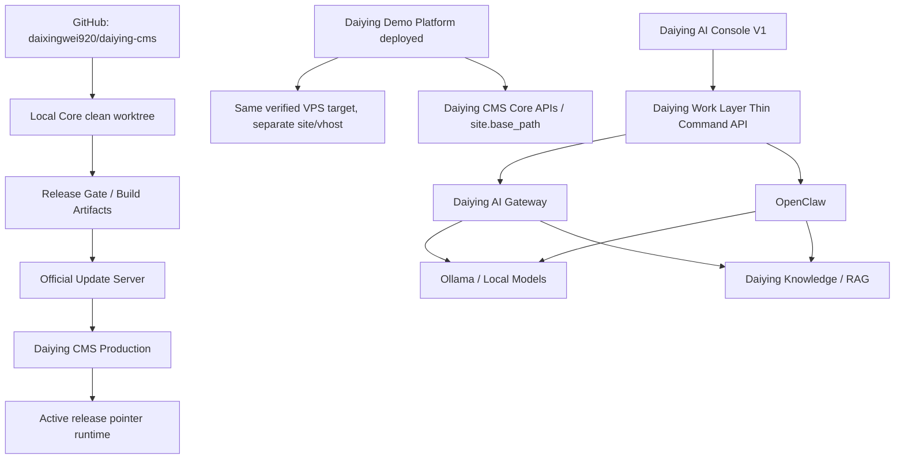

# Daiying Infrastructure And Repository Handoff

Last updated: 2026-09-30

Purpose: long-term bootstrap document for new Codex sessions working on Daiying CMS, Daiying Demo Platform, and Daiying AI infrastructure.

This document records only information verified in this session or explicitly inherited from completed Daiying work in this thread. Unknown or unverified fields are marked as `not verified in this session`.

## 0A. CURRENT STATE - 2026-09-30

This section supersedes older dated state below when there is a conflict.

### Current Release Baseline

- Current Core source-of-truth: GitHub `origin/main`.
- Current baseline version: Daiying CMS Core `1.2.75`.
- Current `origin/main` commit: `c9f16e2c41ba84fe3bf211a6d75e2d5b698ced6c`.
- GitHub Full Installer release: `v1.2.75`.
- GitHub Full Installer ZIP: `daiying-cms-1.2.75-stable.zip`.
- GitHub Full Installer SHA256: `7960a444477ed663e54911aa41ad067c119df8eeeef93ceadedc79a92ea0f474`.
- Update Server stable/latest was observed returning `1.2.75` after the 1.2.74 delta artifact was superseded.
- `1.2.73` was revoked after a frozen migration checksum failure.
- `1.2.74` was withdrawn after a delta update artifact was published where the client required a full Core snapshot.
- Do not republish `1.2.73` or `1.2.74` as stable update artifacts.

### Current NEXT ACTION

```text
Use Daiying CMS Production Release SOP before the next Core release.
```

No new Core version may be formally published merely because code is fixed. The next Core release must enter the Release State Machine and pass the Production Release Checklist in this handoff.

## Production Release History and Incident Lessons

### 1.2.71

1. Why this version was required: 1.2.70 exposed updater/recovery cross-version runtime debt after production upgraded successfully but the old runtime continued executing post-switch cleanup.
2. Previous error: the old updater runtime could prune or rollback using assumptions/classes that were unsafe after active-release pointer switch.
3. Stage: POST-RELEASE and RELEASE execution tail.
4. Root cause: `SWITCHED + POSTCHECK_OK` was not treated as the commit boundary; cleanup/audit exceptions after commit could trigger rollback; old `pruneOldReleases(2)` did not protect running runtime, active release, rollback source, and target release; rollback depended on `RecoveryActions` availability.
5. Fix used: target-side updater fixed cleanup semantics, running runtime preservation, recovery boundary, exit semantics, and runtime bridge/preflight.
6. New issue introduced: none intended in Core runtime, but release process remained too dependent on manual sequencing.
7. Automated tests now present: `tests/updater_runtime_bridge_preflight.php`, `tests/updater_runtime_boundary.php`, release parity gates, and updater runtime bridge preflight.
8. Release Gate coverage: Running Runtime Preservation Gate, Commit Boundary Gate, Recovery Boundary Gate, Exit Semantics Gate.
9. Residual recurrence risk: low if every release runs preflight against previous stable and staging upgrade before production.
10. Mechanism changes required: updater/recovery semantics are Core concerns; production release SOP must require old-runtime bridge compatibility checks.

### 1.2.72

1. Why this version was required: after active-release updates, plugin enablement/version checks could still read stale `config/app.php` instead of active runtime version.
2. Previous error: production behaved like the runtime was older than the active release for plugin compatibility checks.
3. Stage: POST-RELEASE runtime compatibility.
4. Root cause: runtime version display/checks fell back to site-local config, while active Core actually lived under `storage/updates/current-release.json`.
5. Fix used: plugin enablement and lifecycle Core-version checks now use active runtime release version before `config/app.php`.
6. New issue introduced: none known.
7. Automated tests now present: `tests/plugin_enable_runtime_version.php`.
8. Release Gate coverage: Active Runtime Version Gate and production smoke must include plugin enable/disable.
9. Residual recurrence risk: medium if new subsystems read config version directly.
10. Mechanism changes required: Core services must prefer `ActiveReleaseResolver` for runtime identity where active-release matters.

### 1.2.73

1. Why this version was required: Notification Producer V1 Core foundation was needed so update checks, preparations, verifications, executions, and failures create administrator-visible notifications.
2. Previous error: update-related events were invisible in Notification Center.
3. Stage: DEVELOPMENT/PRE-RELEASE missed migration immutability rule.
4. Root cause: PR #14 modified the already-published `2026_09_09_000002_core_notifications` migration instead of placing recipient-scope additions in a new migration.
5. Fix used after failure: PR #16 restored the old migration byte-for-byte and moved recipient columns into `2026_09_29_000001_notification_recipients.php`.
6. New issue introduced: 1.2.73 update artifact was already published/revoked, so the version number could not safely be reused.
7. Automated tests now present: `tests/frozen_migration_checksums.php` and `tests/core_notifications.php`.
8. Release Gate coverage: Frozen Migration Gate must run before any stable push or latest update.
9. Residual recurrence risk: low for migrations covered in `tests/frozen_migration_checksums.php`; medium for future newly-published migrations unless every stable migration is added to the frozen set.
10. Mechanism changes required: release closeout must add every newly published migration checksum to frozen migration coverage.

### 1.2.74

1. Why this version was required: 1.2.73 had to be superseded because stable package identity could not be safely reused after revocation.
2. Previous error: 1.2.73 failed production update with `Core migration checksum changed: 2026_09_09_000002_core_notifications`.
3. Stage: RELEASE artifact construction/publication.
4. Root cause: the release process allowed a delta artifact and a correct full-snapshot artifact to exist side by side; the delta artifact was uploaded/published.
5. Fix used: 1.2.75 was required because `1.2.74` had already been published as the wrong artifact type.
6. New issue introduced: yes, a release-infrastructure failure forced another patch version without Core runtime changes.
7. Automated tests now present: Release Gate V1 rejects modern update packages that are not full Core snapshots; `scripts/release/build` now emits one clearly named `full-snapshot.unsigned.zip` and checks for forbidden `update.json`, `signature.bin`, and `config/app.php`.
8. Release Gate coverage: Full Snapshot Artifact Gate, Single Uploadable Artifact Gate, Update Server Artifact Parity Gate.
9. Residual recurrence risk: low if only `scripts/release/build` output is used and delta files are never left as upload candidates.
10. Mechanism changes required: Update Server upload UI should label/validate full-snapshot unsigned source packages before accepting stable publication.

### 1.2.75

1. Why this version was required: 1.2.74 had already been published as an invalid delta artifact, so a new stable package version was required.
2. Previous error: client rejected the 1.2.74 update with `Core update package is not a full Core snapshot.`
3. Stage: RELEASE artifact publication.
4. Root cause: artifact identity and artifact type were not enforced strongly enough before upload.
5. Fix used: PR #18 bumped release metadata to `1.2.75`; exact commit `c9f16e2c41ba84fe3bf211a6d75e2d5b698ced6c`; generated a full Core snapshot unsigned update source and a GitHub Full Installer from protected `origin/main`; published GitHub `v1.2.75` Full Installer.
6. New issue introduced: none known, but the repeated 1.2.73 -> 1.2.75 patch train is itself a release infrastructure incident.
7. Automated tests now present: release preflight/build scripts, release parity gate, frozen migration tests, installer parity, clean install smoke procedure.
8. Release Gate coverage: exact commit, protected main, full snapshot, installer parity, SHA256, manifest, and GitHub release validation.
9. Residual recurrence risk: medium until signing/publish/postflight become fully integrated with the official Update Server API.
10. Mechanism changes required: signing and publish remain manual/infra-owned; scripts must fail closed unless explicit production infra handles them.

### Incident Principle

If a patch version is required primarily to correct release flow, artifact type, signing, Update Server state, migration immutability, marketplace publication, or GitHub release metadata, classify it as `release infrastructure failure`. First fix the release infrastructure, then publish the next patch. Do not keep increasing Core patch versions to compensate for the same publishing mistake.

## Daiying CMS Production Release SOP

### Source of Truth

- Git repository documentation and release scripts are source of truth.
- `daiyingcms.com` is a publication/display layer.
- Update Server stable/latest is the runtime update authority only after signed artifact parity passes.
- GitHub Release is the Full Installer authority only after installer parity and clean-install smoke pass.
- Production signing private keys are owned by official market/update infrastructure. Development machines must not hold, search for, generate, export, or copy production signing keys.

### Release State Machine

```text
DEVELOPMENT
-> CANDIDATE
-> PREFLIGHT_PASSED
-> ARTIFACT_BUILT
-> ARTIFACT_VERIFIED
-> STAGING_VERIFIED
-> READY_TO_PUBLISH
-> PUBLISHED
-> PRODUCTION_VERIFIED
-> CLOSED
```

Rules:

- No state may be skipped.
- A failed gate returns to `DEVELOPMENT` or `CANDIDATE`; it never advances by explanation.
- `PUBLISHED` is allowed only after human approval at `READY_TO_PUBLISH`.
- `CLOSED` requires final version, commit, SHA256, signature, latest API, GitHub release, production health, and handoff updates to agree.

### Production Release Checklist

1. DEVELOPMENT: complete scoped work in a non-production branch; do not mutate published migrations; do not mix release infrastructure with unrelated features.
2. CANDIDATE: clean worktree; fetch origin; confirm exact commit; confirm local branch is not ahead/behind; confirm commit has remote branch/tag reference; track closeout/audit reports; merge through protected PR only.
3. PREFLIGHT_PASSED: re-read `origin/main`; confirm version; run frozen migration tests, release gates, release phase tests, and version-specific tests; run `scripts/release/preflight <commit>`.
4. ARTIFACT_BUILT: build Full Installer and full-snapshot update source from exact protected main; generate manifest and SHA256; run `scripts/release/build <commit>`.
5. ARTIFACT_VERIFIED: verify installer parity, update package parity, SHA256, manifest, production signature, required migrations, and latest API metadata.
6. STAGING_VERIFIED: clean install from final Full Installer; upgrade previous stable -> candidate with final signed update artifact; verify runtime bridge, recovery/rollback, bundled official plugins, trust grants, reserved prefixes, capability validation, and failure isolation.
7. READY_TO_PUBLISH: human confirms exact commit, version, artifact names, SHA256, signature, destination, and that no withdrawn version number is reused.
8. PUBLISHED: publish GitHub Full Installer if in scope; publish signed update package; update stable/latest only after verification; do not publish marketplace items unless explicitly in scope.
9. PRODUCTION_VERIFIED: read latest API; run production update check; upgrade production only after backup and approval; verify `/health`, version, active release pointer, maintenance false, runtime smoke, notifications, plugins, and admin access.
10. CLOSED: record exact commit, tag, URLs, SHA256, signatures, latest API, production health, incident notes, and risks in this handoff; add new failure modes and gates before the next release.

### Hard Release Gates

Any failed gate means `FAIL-CLOSED`. Do not push stable, modify latest, publish installer/update package, publish marketplace items, or announce release.

- Clean Worktree Gate
- Protected Main Gate
- Exact Commit Gate
- Remote Ref Gate
- No Local Ahead Gate
- Tracked Closeout Report Gate
- Frozen Migration Gate
- Release Parity Gate
- Full Snapshot Update Gate
- Installer Parity Gate
- Manifest/SHA256 Gate
- Production Signature Gate
- Update Server Stable/Latest Parity Gate
- Migration Chain Gate
- Updater Runtime Compatibility Gate
- Recovery/Rollback Gate
- Staging Upgrade Gate
- Production Backup Gate
- Production Health Gate
- Final Commit/Version/Artifact Reconciliation Gate

### Automation Entry Points

```text
scripts/release/preflight
scripts/release/build
scripts/release/sign
scripts/release/verify
scripts/release/publish
scripts/release/postflight
```

- `preflight` runs clean-tree, protected-main, remote-ref, tag, migration, notification, SDK, release gate, and release phase checks.
- `build` builds the exact-commit GitHub Full Installer and unsigned full-snapshot update source package, then verifies installer parity without requiring a Full Installer signature sidecar.
- `sign` intentionally fail-closes because production signing is server-side only.
- `verify` verifies a signed update package and latest API JSON against exact commit.
- `publish` intentionally fail-closes because human approval and official infrastructure are required.
- `postflight` checks production health/latest API after publication.

Principle:

```text
Human approves. Scripts check. Codex does not publish from memory.
```

## Known Release Failure Modes

### Local baseline exists but remote has no branch/tag reference

- Symptom: a candidate commit exists locally, but no remote branch/tag contains it.
- Root cause: local-only release baseline.
- Detect: `git branch -r --contains <commit>` and `git tag --contains <commit>` return empty.
- Fix: push branch and merge through protected PR, or stop if it is not an approved candidate.
- Prevent: Remote Ref Gate.
- Stage: PRE-RELEASE.

### Current branch is ahead 1

- Symptom: local branch contains unpushed release edits.
- Root cause: release work continued locally after PR/merge point.
- Detect: `git rev-list --count origin/main..HEAD`.
- Fix: push through PR or discard only explicitly approved local work.
- Prevent: No Local Ahead Gate.
- Stage: PRE-RELEASE.

### Closeout report is untracked

- Symptom: release evidence exists only as an untracked local file.
- Root cause: report created outside tracked release PR.
- Detect: `git status --porcelain`.
- Fix: add report to PR or explicitly mark it out-of-band in handoff.
- Prevent: Tracked Closeout Report Gate.
- Stage: PRE-RELEASE.

### Old updater runtime continues after active pointer switch

- Symptom: upgrade commits successfully, then late cleanup/audit code fails as if upgrade failed.
- Root cause: PHP continues under old runtime after active pointer changes.
- Detect: previous-stable -> candidate staging upgrade with runtime bridge and process-boundary tests.
- Fix: treat `SWITCHED + POSTCHECK_OK` as commit boundary; late cleanup becomes warning.
- Prevent: Updater Runtime Compatibility Gate and Commit Boundary Gate.
- Stage: RELEASE / POST-RELEASE.

### `pruneOldReleases` deletes still-running old release

- Symptom: post-switch autoload failures or missing old runtime files.
- Root cause: prune retained newest releases by mtime without protecting running runtime.
- Detect: stale release fixture where old prune plan would delete running release.
- Fix: protect active, running, rollback source, and target releases.
- Prevent: Running Runtime Preservation Gate.
- Stage: RELEASE.

### Rollback depends on new-version-only `RecoveryActions`

- Symptom: rollback/recovery fatal because old runtime cannot autoload a new recovery class.
- Root cause: cross-version recovery used target-version-only code.
- Detect: previous-stable runtime rollback fixture.
- Fix: keep recovery mode file operations inside stable updater boundary.
- Prevent: Recovery Boundary Gate.
- Stage: RELEASE.

### Bundled official plugin trust grant missing

- Symptom: bundled official plugin is treated as untrusted in clean install.
- Root cause: release package/install/bootstrap did not preserve official identity/trust grant chain.
- Detect: clean install from final ZIP and bundled official plugin bootstrap test.
- Fix: align bundled official plugin identity, registry entry, and trust grant.
- Prevent: Bundled Official Plugin Gate.
- Stage: PRE-RELEASE / RELEASE.

### Reserved plugin table prefix blocks official plugin

- Symptom: `Plugin table prefix is reserved` for an official bundled/market plugin.
- Root cause: reserved prefix exists but official identity/trust grant does not match.
- Detect: plugin bootstrap and table prefix ownership tests.
- Fix: reserve prefix only for matching official identity and trust source.
- Prevent: Reserved Prefix Trust Gate.
- Stage: PRE-RELEASE.

### Manifest permission/capability causes plugin to disappear

- Symptom: plugin is skipped with unclear admin feedback.
- Root cause: manifest declares unknown capability such as `admin.menu`.
- Detect: manifest validation and negative capability tests.
- Fix: fail with explicit `Unknown capability: <name>` and isolate the plugin.
- Prevent: Capability Registry Gate.
- Stage: PRE-RELEASE.

### stable package/latest API/Update Server does not match commit/version

- Symptom: latest API returns a version/SHA/signature different from intended artifact.
- Root cause: stable/latest updated from wrong package or stale metadata.
- Detect: latest API parity check against final artifact SHA256 and exact commit.
- Fix: withdraw bad package and publish a new version if stable identity was already used.
- Prevent: Update Server Stable/Latest Parity Gate.
- Stage: RELEASE.

### Updater writable/support file allowlist rejects needed file

- Symptom: update package cannot carry a support file needed by the new release.
- Root cause: previous-stable client allowlist does not recognize the new path.
- Detect: previous-stable package validation against candidate ZIP.
- Fix: avoid shipping new operational support paths until previous stable allows them, or add bridge outside update ZIP.
- Prevent: Previous-Stable Allowlist Gate.
- Stage: PRE-RELEASE.

### Migration Chain cross-version upgrade failure

- Symptom: direct previous-stable -> candidate upgrade fails on migration order, checksum, or missing required migration.
- Root cause: migration chain not tested across the actual upgrade floor.
- Detect: migration chain fixture and required migrations parity.
- Fix: add new migration, never mutate old migration; update required migration metadata.
- Prevent: Migration Chain Gate and Frozen Migration Gate.
- Stage: PRE-RELEASE / RELEASE.

### Signature, SHA256, manifest, and final artifact disagree

- Symptom: client rejects package or latest API cannot verify package.
- Root cause: artifact changed after manifest/signature, or wrong file uploaded.
- Detect: SHA256 and signature verification after download from production endpoint.
- Fix: regenerate metadata/signature from final artifact through official signing flow; if version was published, release a new version.
- Prevent: Manifest/SHA256 Gate and Production Signature Gate.
- Stage: RELEASE.

### Delta update artifact published when client requires full Core snapshot

- Symptom: `Core update package is not a full Core snapshot.`
- Root cause: release process allowed a delta package to be uploaded as stable.
- Detect: package reader / release parity full snapshot check before upload and after production download.
- Fix: withdraw bad version and publish a new version with a full-snapshot artifact.
- Prevent: Full Snapshot Update Gate and Single Uploadable Artifact Gate.
- Stage: RELEASE.

## 0. CURRENT STATE - 2026-09-27

This section supersedes older dated state below when there is a conflict.

### Production

- Daiying CMS production is on Core `1.2.70`.
- Current production state verified after the 1.2.69 -> 1.2.70 release:
  - `/health`: `ok`
  - mode: `NORMAL`
  - version: `1.2.70`
  - active release id: `daiying-cms-core-update-1.2.70`
  - maintenance: `false`
  - active release integrity: `ok`
- Do not rollback production 1.2.70.
- Do not patch production Core files directly.
- Do not overwrite the already-published 1.2.70 artifact, tag, GitHub Release, or Update Server package.

### Authoritative Repository / Worktree

- GitHub repository: `https://github.com/daixingwei920/daiying-cms.git`
- `origin/main`: `92daf80e5641b644fb73ad69a54ccf65b77ad2d9`
- `v1.2.70` tag: `22e72ee442722e8fa28498cf872aead071421830`
- Current active development worktree for the 1.2.71 updater fix:

```text
/Users/xingweidai/Documents/Codex/2026-09-25/files-mentioned-by-the-user-daiying-2/work/daiying-cms-sdk-foundation
```

- Current local branch in that worktree: `plugin-sdk-foundation-v1`
- Current local HEAD before 1.2.71 docs/state refresh: `b0c2eff593842a7ab8fb38da68814fbacaa76816`
- Current worktree has intentional uncommitted 1.2.71 candidate changes for updater/runtime bridge work. It is not a release-ready clean tree.
- The older path below is no longer the authoritative release source unless re-verified:

```text
/Users/xingweidai/Documents/Codex/2026-09-03/daiying-cms-core-theme/work/daiying-cms-core-clean-1.2.63
```

### Plugin SDK Foundation

Core `1.2.70` has been formally released with Plugin SDK Foundation V1:

- `ContentService`
- `FrontUserService`
- request `rawBody()`
- Block Renderer registry
- formal Event Registry
- Capability Registry
- Scheduler contract
- Commercial License Service
- Official Plugin Skeleton

The Plugin SDK Foundation was dogfooded with `official.wechat`. Dogfood adaptation is complete, but `official.wechat` has not been formally published. Do not continue `official.wechat` RC or Market publication until the updater technical debt is closed.

### Current Core Candidate

- Current candidate: Daiying CMS Core `1.2.71`
- Purpose: fix Updater / Recovery cross-version runtime technical debt before any more plugin or SDK feature work.
- Target-side updater fix is implemented in the current worktree, but not released.
- Runtime bridge / preflight for 1.2.70 -> 1.2.71 is implemented and tested locally, but not run on production.
- 1.2.71 Release Gate was intentionally paused while developer documentation publication and Theme Contract alignment work completed. NEXT ACTION remains the 1.2.71 Release Gate.

### Theme Development Spec V1 / Theme Framework

Theme Contract Alignment completed on 2026-09-27.

- Branch: `theme/theme-contract-v1-alignment`
- PR: `https://github.com/daixingwei920/daiying-cms/pull/8`
- Local candidate commit: `36fb25a42fd81d37efe8dfb57ab246bed9c7680a`
- Merged `origin/main`: `ffcd05ad2362bf770428024dfa0b10df44462612`
- Report: `THEME_FRAMEWORK_CORE_1.2.70_ALIGNMENT_AND_DOGFOOD_REPORT.md`
- Decision: `READY_TO_FINALIZE_V1`
- Core Runtime changes: none
- Updater / 1.2.71 changes: none
- official.wechat / Plugin SDK changes: none

Verified:

- Theme Framework blank starter manifest now uses Core 1.2.70 `theme_id`, `core`, and `settings_schema`.
- Theme Framework blank starter CSS/JS now lives under `assets/`, matching `TemplateContext::asset()`.
- Daojia 1.7.11, Guofeng Zhuhong 1.7.10 URL-fix artifact, and Xifang Ersheng 0.1.22 official-market ZIP dogfood passed.
- No Core GAP was found.

Theme Spec V1 Finalization and website publication completed on 2026-09-27.

- PR: `https://github.com/daixingwei920/daiying-cms/pull/9`
- Merged `origin/main`: `5113715ec839e27b42e1bdb03ea41e306bd27f0a`
- Publication report PR: `https://github.com/daixingwei920/daiying-cms/pull/10`
- Current `origin/main` after report merge: `92daf80e5641b644fb73ad69a54ccf65b77ad2d9`
- Developer docs display commit: `6c7609323975014112ce76440be98add7c1dbe56`
- Report: `THEME_DEVELOPMENT_SPEC_V1_FINALIZATION_AND_PUBLICATION_REPORT.md`
- Theme Spec status: `V1 FINAL / PUBLISHED`
- Current source of truth: `DAIYING_THEME_DEVELOPMENT_SPEC_V1.md`
- Target: `Daiying CMS Core 1.2.70+`
- Website entry verified: `Theme Spec V1（Core 1.2.70+）`
- Legacy 2026-08-31 Theme Development Specification remains Legacy / Superseded and is not the default entry.
- Core Runtime changes: none
- Updater / 1.2.71 changes: none
- official.wechat / Plugin SDK changes: none

### 1.2.69 -> 1.2.70 Updater Root Cause

Production 1.2.69 -> 1.2.70 actually reached the commit point successfully:

- migrations completed
- active release pointer switched to 1.2.70
- post-switch health was OK
- update operation was recorded `Completed`

The fatal happened afterward in the post-commit cleanup/audit tail.

Root cause:

- The PHP updater runtime started under old 1.2.69 code and continued running after the active pointer switched to 1.2.70.
- Old `pruneOldReleases(2)` retained only the two newest release directories by `filemtime`.
- It did not protect:
  - active release
  - running updater runtime
  - rollback source
  - target release
- In a stale-release layout, prune could delete the release directory still used by the running PHP process.
- A later autoload then failed.
- The generic catch block incorrectly treated post-commit cleanup failure as full upgrade failure and entered rollback.
- Rollback tried to use `Cms\Core\Recovery\RecoveryActions`, which the old runtime could not load, causing the observed fatal.

### 1.2.71 Target-Side Fix

The 1.2.71 candidate keeps these updater fixes:

1. running updater runtime must not be pruned
2. active release must not be pruned
3. `SWITCHED + POSTCHECK_OK` is the explicit commit boundary
4. cleanup/audit/prune failures after commit become warnings, not rollback triggers
5. updater recovery mode file operations do not depend on new-version-only `RecoveryActions`
6. successful committed upgrades must exit 0
7. true pre-commit failures still enter rollback/recovery and return non-zero

Detailed report:

```text
/Users/xingweidai/Documents/Codex/2026-09-25/files-mentioned-by-the-user-daiying-2/work/daiying-cms-sdk-foundation/UPDATER_RECOVERY_CROSS_VERSION_ROOT_CAUSE_AND_FIX_REPORT.md
```

### 1.2.70 -> 1.2.71 Runtime Bridge

The 1.2.71 target-side fix cannot flow backward into an already-running 1.2.70 updater process. Therefore the current worktree adds a strict preflight bridge:

```text
/Users/xingweidai/Documents/Codex/2026-09-25/files-mentioned-by-the-user-daiying-2/work/daiying-cms-sdk-foundation/scripts/preflight_updater_runtime_bridge.php
```

Strategy: strict preflight plus optional safe stale cleanup.

The bridge:

- is standalone PHP
- does not load Core autoload
- does not depend on 1.2.71 classes
- does not depend on `RecoveryActions`
- does not depend on Plugin SDK
- does not access the database
- does not run migrations
- does not enter maintenance
- does not modify `current-release.json`

It uses the exact old 1.2.70 `pruneOldReleases(2)` rule to simulate which release directories the old updater would delete after target staging, then returns `SAFE` or `UNSAFE`.

SAFE requires proof that:

- active pointer is valid
- running release is known
- running release has Core bootstrap
- target staging does not already exist
- old 1.2.70 prune plan will not delete running release
- old 1.2.70 prune plan will not delete active release

`--apply-cleanup` may delete only release directories proven to be:

- inactive
- stale
- not active
- not running
- not target
- realpath-resolved under `storage/updates/releases`

If any identity cannot be proven, fail closed.

Important release limitation:

- Do not include `scripts/preflight_updater_runtime_bridge.php` as a new operational support file inside the 1.2.71 update ZIP.
- Old 1.2.70 `UpdatePackageManifest::isAllowedUpdatePath()` rejects previous-stable-unknown operational support paths.
- The bridge is a Release Gate / deployment preflight tool, not a new file to deliver through the 1.2.71 Core update ZIP.

Cross-version proof already completed locally:

- unpatched 1.2.70 runtime -> patched 1.2.71 candidate
- stale releases deliberately arranged to trigger old prune risk
- bridge returned `SAFE`
- dangerous stale release was safely removed
- old 1.2.70 `UpdateService::execute()` actually executed
- update result: `Completed`
- active pointer: `1.2.71`
- maintenance lock: none
- recovery lock: none
- update lock: none
- CLI exit: 0

Detailed report:

```text
/Users/xingweidai/Documents/Codex/2026-09-25/files-mentioned-by-the-user-daiying-2/work/daiying-cms-sdk-foundation/UPDATER_RUNTIME_BRIDGE_1.2.70_TO_1.2.71_REPORT.md
```

### NEXT ACTION

Next approved technical step:

```text
Daiying CMS Core 1.2.71 Release Gate
```

Before formal production deployment, first run this read-only preflight against production 1.2.70:

```bash
php scripts/preflight_updater_runtime_bridge.php \
  --root=/www/wwwroot/saas.daiyinggame.com \
  --target-release-id=daiying-cms-core-update-1.2.71 \
  --json
```

Do not include `--apply-cleanup` on the first run.

If the result is `SAFE`, continue the normal Release Gate / deployment flow. If the result is `UNSAFE`, inspect the JSON output. Only run `--apply-cleanup` if every deletion candidate is proven to be an inactive stale release. If active identity, running identity, target state, realpath, or rollback source is unclear, fail closed and stop.

### LAST COMPLETED

- Daiying CMS Core `1.2.70` Plugin SDK Foundation production release completed through protected PR flow.
- PR `plugin-sdk-foundation-v1 -> main` merged normally; no branch protection bypass.
- `v1.2.70` tag points at the 1.2.70 release merge commit `22e72ee442722e8fa28498cf872aead071421830`.
- Update Server stable/latest was updated to 1.2.70 and verified by public API/download SHA/signature checks.
- Production CMS upgraded from 1.2.69 to 1.2.70 and smoke-tested healthy.
- Updater/Recovery cross-version root cause investigation completed.
- 1.2.71 target-side updater fix implemented locally.
- 1.2.70 -> 1.2.71 strict preflight bridge implemented locally and proven with fixtures.
- Handoff refresh completed on 2026-09-27.
- Plugin SDK V1 public documentation publication completed on 2026-09-27 through docs-only PR `#5`.
- PR `docs/plugin-sdk-v1-publication -> main` merged normally; no branch protection bypass.
- New SDK index: `docs/plugin-sdk/README.md`.
- Legacy plugin API path retained and marked superseded: `PLUGIN_API_V1.md`.
- Developer documentation website sync completed on 2026-09-27.
- Core docs PR `#6` added `DAIYING_THEME_DEVELOPMENT_SPEC_V1_PROPOSAL.md` and `DAIYING_DEVELOPER_DOCUMENTATION_SYNC_REPORT.md`.
- Core docs PR `#7` recorded actual website verification results.
- `daiying-cms-developer-docs` commit `e436d85` now treats the Core repository as source of truth and marks old Plugin/Theme specs as Legacy / Superseded.
- Production website developer links were updated in the active website theme template after backing it up; production health remained `ok`, `NORMAL`, `1.2.70`.

### BLOCKERS

- Do not start 1.2.71 Release Gate until this Handoff and bridge reports have been reviewed.
- 1.2.71 production deployment must start with the read-only bridge preflight; cleanup requires explicit review of deletion candidates.
- The bridge script must not be inserted into the 1.2.71 update ZIP as a new operational support file because previous stable 1.2.70 rejects unknown support paths.

### EXACT COMMITS

```text
1.2.70 original candidate head: b0c2eff593842a7ab8fb38da68814fbacaa76816
1.2.70 merged origin/main commit: 22e72ee442722e8fa28498cf872aead071421830
v1.2.70 tag: 22e72ee442722e8fa28498cf872aead071421830
Plugin SDK V1 docs publication PR #5 merge commit: a69998cd475b04ba9491613cc000c27232c2d643
Plugin SDK V1 docs publication branch commit: 74b69cbc9319055e929e48a879d1a0edcbd2e3fc
Developer docs website sync PR #6 merge commit: b0144ae2686b45a6e8e04a0cf8afb8292e0a7b3c
Developer docs website verification PR #7 merge commit: 723e95143a16b5b84e788e1bdb48184841c95c1e
daiying-cms-developer-docs display-layer commit: e436d85
current local 1.2.71 candidate worktree HEAD before uncommitted changes: b0c2eff593842a7ab8fb38da68814fbacaa76816
```

### IMPORTANT REPORTS

Do not move or duplicate these solely for handoff. Current verified paths:

```text
/Users/xingweidai/Documents/Codex/2026-09-25/files-mentioned-by-the-user-daiying-2/outputs/DAIYING_PLUGIN_SDK_V1_DESIGN_PROPOSAL.md
/Users/xingweidai/Documents/Codex/2026-09-25/files-mentioned-by-the-user-daiying-2/work/daiying-cms-sdk-foundation/PLUGIN_SDK_FOUNDATION_IMPLEMENTATION_REPORT.md
/Users/xingweidai/Documents/Codex/2026-09-25/files-mentioned-by-the-user-daiying-2/work/daiying-cms-sdk-foundation/PLUGIN_SDK_LICENSE_SERVICE_IMPLEMENTATION_REPORT.md
/Users/xingweidai/Documents/Codex/2026-09-25/files-mentioned-by-the-user-daiying-2/outputs/OFFICIAL_WECHAT_SDK_DOGFOOD_ADAPTATION_REPORT.md
/Users/xingweidai/Documents/Codex/2026-09-25/files-mentioned-by-the-user-daiying-2/work/daiying-cms-sdk-foundation/outputs/release-gate-1.2.70-plugin-sdk-foundation/RELEASE_GATE_1.2.70_PLUGIN_SDK_FOUNDATION_REPORT.md
/Users/xingweidai/Documents/Codex/2026-09-25/files-mentioned-by-the-user-daiying-2/work/daiying-cms-sdk-foundation/UPDATER_RECOVERY_CROSS_VERSION_ROOT_CAUSE_AND_FIX_REPORT.md
/Users/xingweidai/Documents/Codex/2026-09-25/files-mentioned-by-the-user-daiying-2/work/daiying-cms-sdk-foundation/UPDATER_RUNTIME_BRIDGE_1.2.70_TO_1.2.71_REPORT.md
/Users/xingweidai/Documents/Codex/2026-09-25/files-mentioned-by-the-user-daiying-2/work/daiying-cms-docs-plugin-sdk-v1/PLUGIN_SDK_V1_DOCUMENTATION_PUBLICATION_REPORT.md
/Users/xingweidai/Documents/Codex/2026-09-25/files-mentioned-by-the-user-daiying-2/work/daiying-cms-docs-plugin-sdk-v1/DAIYING_DEVELOPER_DOCUMENTATION_SYNC_REPORT.md
/Users/xingweidai/Documents/Codex/2026-09-25/files-mentioned-by-the-user-daiying-2/work/daiying-cms-docs-plugin-sdk-v1/DAIYING_THEME_DEVELOPMENT_SPEC_V1_PROPOSAL.md
```

### Permanent Core Release Gate Rules

Every future Core Release Gate must include:

- Previous Stable -> Candidate fixture upgrade
- Running Runtime Preservation Gate
- Commit Boundary Gate: `SWITCHED + POSTCHECK_OK` cleanup/audit failure must not rollback
- Exit Semantics Gate: committed success exits 0; true failure exits non-zero
- Previous-Stable Update Package Allowlist Gate: candidate ZIP must not contain previous-stable-rejected operational support paths
- Frozen Migration Gate: any `system/migrations/*.php` file that already exists in a historical stable tag/release is append-only and byte-for-byte frozen. Release Gate must compare the candidate against historical stable migration checksums and fail closed if an existing migration is modified, renamed, reordered, deleted, or has SHA256 drift. New migrations are allowed; changing an already-published migration is never allowed.

### Documentation Publication

COMPLETED on 2026-09-27.

- PR: `https://github.com/daixingwei920/daiying-cms/pull/5`
- Merge commit: `a69998cd475b04ba9491613cc000c27232c2d643`
- New SDK index: `docs/plugin-sdk/README.md`
- Legacy path retained and marked superseded: `PLUGIN_API_V1.md`
- Report: `PLUGIN_SDK_V1_DOCUMENTATION_PUBLICATION_REPORT.md`

No runtime code, updater code, release artifacts, production configuration, package versions, or marketplace publication state changed as part of that docs-only task.

### Current DO NOT List

- Do not rollback production 1.2.70.
- Do not overwrite the published 1.2.70 artifact.
- Do not modify the 1.2.70 tag.
- Do not secretly patch production 1.2.70 Core.
- Do not continue official.wechat RC.
- Do not publish the WeChat market package.
- Do not migrate AI Writer.
- Do not migrate Membership.
- Do not start new Plugin SDK P1/P2 work.
- Do not bypass GitHub main branch protection.

### CODEX NEW SESSION START PROTOCOL

Before any new Codex session performs Daiying work:

1. Read this file: `DAIYING_INFRASTRUCTURE_AND_REPOSITORY_HANDOFF.md`.
2. Read `CURRENT STATE`, `LAST COMPLETED`, `NEXT ACTION`, `BLOCKERS`, and `EXACT COMMITS`.
3. Read the detailed report referenced by the current task.
4. Run `git fetch`.
5. Verify remote, branch, HEAD, `origin/main`, and worktree status.
6. If production is involved, first perform read-only checks of production version, `/health`, and active release pointer.
7. If Handoff, Git, or production state disagree, stop and report the difference.
8. Do not continue from old chat memory.
9. Do not rerun tasks already marked completed.
10. Start from `NEXT ACTION`.

### Handoff Maintenance Rule

Before closing a Codex conversation, update:

- CURRENT STATE
- LAST COMPLETED
- NEXT ACTION
- BLOCKERS
- EXACT COMMITS
- PRODUCTION VERSION
- ACTIVE RELEASE
- IMPORTANT REPORTS

The project must be recoverable from repository and handoff documents without old chat context.

## 1. Infrastructure Overview



Known components:

- Daiying CMS Production Server: verified.
- Official Update Server: used in this project; path known from prior verified work.
- Local AI Workstation / Laptop AI Node: verified on 2026-09-21 as `daiying-ai` at LAN IP `192.168.1.149`.
- GitHub repository: verified.
- Local authoritative Core worktree: verified.
- Demo Platform: deployed and validated on `demo.daiyingcms.com`; independent from CMS Core.
- OpenClaw / Ollama / Daiying Knowledge / RAG / Daiying AI Console: verified deployed on `daiying-ai` during read-only Phase 1 discovery on 2026-09-21.
- Daiying Work Layer Phase 2 Thin Command API: verified deployed on `daiying-ai` on 2026-09-21 as a localhost-only user service.
- Daiying Work Layer Phase 4 Secure Remote Command Bridge V1: verified deployed on `daiying-ai` on 2026-09-21 as a localhost-only security boundary service. No public route was opened.
- Daiying Work Layer Phase 5 public hostname: `https://remote.chinesedepartmentstore.com` routes through Cloudflare Tunnel to Remote Bridge `127.0.0.1:19291`; security, E2E, and restart/persistence tests passed on 2026-09-22. Final verdict: `PHASE5_PASS`.
- Daiying Work Layer Phase 6 Remote Work Delegation V1: `work.delegate` verified through the public Remote Bridge on 2026-09-22 for Knowledge, Writing, Planning, Diagnostic, blocked-action, insufficient-context, audit/history, and Phase 5 regression tests. Final verdict: `PHASE6_PASS`.
- Daiying Work Layer Phase 7 Public-Safe Approval Layer V1: independent approval records and execution authorization artifacts verified through the public HTTPS Remote Bridge on 2026-09-22; LAN Console Approval Center added. Approval does not execute, does not queue source tasks, and authorizations remain unconsumed until a future executor phase. Final verdict: `PHASE7_PASS`.

## 2. Server Inventory

### Daiying CMS Production / Official Update Server

- Role: Daiying CMS production server and official update-server host.
- Host/IP: `74.208.66.221`
- Hostname: `my-vps` verified by SSH.
- SSH user: `root`
- SSH port: default `22` unless SSH config overrides it; no custom port was verified.
- OS: not verified in this handoff.
- Web stack: Apache is known from production theme asset/vhost work; full service state not re-verified in this handoff.
- PHP: `PHP 8.5.9 (cli)` verified by `php -v`.
- Web user/group: `www:www` known from production file ownership checks in prior work.
- Production: yes.
- Public internet exposure: yes, production websites are public.
- Current用途:
  - Daiying CMS production site.
  - Official update server.
  - Multiple Apache vhosts must not be disturbed.

Important verified paths:

- Daiying CMS production root: `/www/wwwroot/saas.daiyinggame.com`
- Public production domain: `https://www.daiyingcms.com`
- Production health endpoint: `https://www.daiyingcms.com/health`
- Official update server root: `/www/wwwroot/updates.daiyinggame.com`
- Update storage: `/www/wwwroot/saas.daiyinggame.com/storage/updates`
- Active release directory after 1.2.70: `/www/wwwroot/saas.daiyinggame.com/storage/updates/releases/daiying-cms-core-update-1.2.70`
- Active release pointer: `/www/wwwroot/saas.daiyinggame.com/storage/updates/current-release.json`
- CMS logs path: `/www/wwwroot/saas.daiyinggame.com/storage/logs`
- Apache vhost path: known from prior work as `/www/server/panel/vhost/apache/`; exact vhost files should be verified read-only before edits.
- SSL / Let's Encrypt management: not verified in this handoff.

### Local AI Workstation / Laptop AI Node

- Role: Daiying Local AI / OpenClaw Node.
- Hostname: `daiying-ai`
- LAN IP: `192.168.1.149`
- SSH alias: `daiying-ai`
- SSH user: `daiying`
- SSH port: `22`
- OS: Ubuntu 24.04.5 LTS
- Kernel: `6.8.0-139-generic`
- CPU: Intel Core i7-10870H, 8 cores / 16 threads
- GPU / VRAM: NVIDIA GeForce RTX 3060 Laptop GPU, 6144 MiB VRAM
- NVIDIA driver / CUDA reported by `nvidia-smi`: 595.84 / 13.2
- RAM: 15 GiB total
- Disk: `/` 98G total; `/srv/daiying-ai` 196G total
- Public exposure: local `cloudflared.service` is active. Phase 5 verified `remote.chinesedepartmentstore.com -> 127.0.0.1:19291`, preserved `ai.chinesedepartmentstore.com -> 127.0.0.1:19090`, and confirmed direct public TCP probes to internal AI ports were not reachable.

This node is suitable as a Daiying AI Control Node, RAG/Knowledge node, monitoring node, small local LLM node, and backup/legacy worker. Do not assume it is suitable for sustained large coding, image, or video models.

## 3. SSH Access

Verified production SSH command form:

```bash
ssh -i ~/.ssh/daiying_vps_codex root@74.208.66.221
```

Verified read-only command:

```bash
ssh -i ~/.ssh/daiying_vps_codex -o BatchMode=yes -o ConnectTimeout=8 root@74.208.66.221 'hostname; whoami; pwd; php -v | head -n 1'
```

Verified output:

- `hostname`: `my-vps`
- `whoami`: `root`
- `pwd`: `/root`
- `php -v`: `PHP 8.5.9 (cli)`

Authentication notes:

- Uses existing local SSH key.
- Reuse existing authenticated local SSH environment.
- Do not ask the user to paste passwords or private keys.

Forbidden in documentation:

- SSH password
- private key
- token
- cookie
- secret

## 4. Daiying CMS Production

Production domain:

- `https://www.daiyingcms.com`

Current production health verified (refreshed 2026-09-27; see `CURRENT STATE - 2026-09-27` for latest release context):

```json
{
  "status": "ok",
  "mode": "NORMAL",
  "version": "1.2.70",
  "release_id": "daiying-cms-core-update-1.2.70",
  "maintenance": false,
  "installed": true
}
```

Current production version:

- Daiying CMS `1.2.70`

Current active release id:

- `daiying-cms-core-update-1.2.70`

Architecture fact:

> Daiying CMS uses an active-release pointer model. Runtime Core and Root Shell are different concepts.

Runtime behavior:

- Web and CLI prefer `storage/updates/current-release.json`.
- The pointer chooses the active release under `storage/updates/releases/{release_id}`.
- A stale root shell version does not automatically mean production runtime is stale.
- Root shell integrity and active release integrity are different checks.

Important current rule:

- `current-release.json` must be readable by the web user.
- If root/CLI runs updater code, always check ownership and permissions afterward.

## 5. CMS Production Safety Rules

New Codex sessions must follow these rules:

1. Default to read-only checks first.
2. Never modify production Core without explicit approval.
3. Before modifying production files, create a timestamped backup.
4. Never bypass updater integrity guard.
5. Never force update.
6. Never copy a local Core worktree directly over production Core.
7. Never use a dirty or legacy worktree for official release.
8. Release Gate failure means fail closed.
9. HIGH / CRITICAL operations require human approval.
10. Do not affect unrelated Apache vhosts.
11. After production update, verify `/health`.
12. After root/CLI updater work, verify `current-release.json` ownership and permissions.

## 6. Git Repository Handoff

### Formal Daiying CMS Repository

- Repository: `daixingwei920/daiying-cms`
- Remote URL verified:

```text
https://github.com/daixingwei920/daiying-cms.git
```

- Default branch: `main`
- Current verified local branch for active updater candidate worktree: `plugin-sdk-foundation-v1`
- Current verified HEAD:

```text
b0c2eff593842a7ab8fb38da68814fbacaa76816
```

- Current verified `origin/main` / `v1.2.70` release commit:

```text
22e72ee442722e8fa28498cf872aead071421830
```

- Current production release: Daiying CMS `1.2.70`
- Current production release id: `daiying-cms-core-update-1.2.70`

Verified local Git state:

```text
 M CHANGELOG.md
 M config/app.example.php
 M config/app.php
 M system/core-manifest.json
 M system/core/Update/UpdateService.php
?? UPDATER_RECOVERY_CROSS_VERSION_ROOT_CAUSE_AND_FIX_REPORT.md
?? UPDATER_RUNTIME_BRIDGE_1.2.70_TO_1.2.71_REPORT.md
?? scripts/preflight_updater_runtime_bridge.php
?? tests/updater_runtime_boundary.php
?? tests/updater_runtime_bridge_preflight.php
```

That means the active 1.2.71 candidate worktree is intentionally dirty with updater/runtime bridge changes and reports. It is not a release-ready clean tree.

### Authoritative Core Worktree

Current authoritative active worktree for 1.2.71 updater candidate:

```text
/Users/xingweidai/Documents/Codex/2026-09-25/files-mentioned-by-the-user-daiying-2/work/daiying-cms-sdk-foundation
```

Branch:

```text
plugin-sdk-foundation-v1
```

HEAD and release baseline:

```text
HEAD: b0c2eff593842a7ab8fb38da68814fbacaa76816
origin/main: 22e72ee442722e8fa28498cf872aead071421830
v1.2.70: 22e72ee442722e8fa28498cf872aead071421830
```

The older 2026-09-03 clean worktree was authoritative for earlier releases but is no longer the active authority unless re-verified.

Legacy / dirty workspaces:

- Older `work/daiying-cms` and historical WIP directories are legacy/WIP unless explicitly re-verified.
- Do not release from old dirty workspaces.
- Do not use historical unverified clones as official release sources.

## 7. Git Authentication

Authentication mechanism:

- Reuse existing authenticated local Git environment.
- The remote uses HTTPS. Authentication may be via existing credential helper or existing authenticated session.

Do not record:

- GitHub PAT
- SSH private key
- password
- token

## 8. Demo Platform

Phase 1 status as of 2026-09-21:

- Deployed and validated.
- Production Daiying CMS Core was not modified.
- Production health remained `ok`, `NORMAL`, version `1.2.67`, release id `daiying-cms-core-update-1.2.67` after deployment.

Verified domain:

```text
demo.daiyingcms.com
```

Verified HTTPS:

- Let's Encrypt certificate subject: `CN=demo.daiyingcms.com`
- Issuer: `YE2`
- Valid from: `2026-09-21 03:20:09 GMT`
- Valid until: `2026-12-20 03:20:08 GMT`
- HTTP redirects to HTTPS.

Target server:

- Same verified VPS: `74.208.66.221` / `my-vps`.

URL strategy in use:

```text
demo.daiyingcms.com/{demo-slug}/
```

Phase 1 demos:

- Demo Center: `https://demo.daiyingcms.com/`
- Default: `https://demo.daiyingcms.com/default/`
- Daojia: `https://demo.daiyingcms.com/daojia/`
- Guofeng Zhuhong: `https://demo.daiyingcms.com/guofeng/`

Core support:

- Daiying CMS `1.2.67` includes generic `site.base_path` support.
- Demo Platform must remain independent from CMS Core.
- No per-theme Core hacks.
- No `if ($isDemoSite)` behavior in Core.

Server layout:

```text
/www/wwwroot/demo.daiyingcms.com
  /index.php
/www/wwwroot/Daiying-Demo-Platform
  /bin/create-demo
  /manager/index.php
  /registry/demos.json
  /instances/default
  /instances/daojia
  /instances/guofeng
```

Apache vhost:

```text
/www/server/panel/vhost/apache/demo.daiyingcms.com.conf
```

Apache details verified:

- Port 80 handles ACME challenge and redirects other traffic to HTTPS.
- Port 443 serves `/`, `/_manager/`, `/default/`, `/daojia/`, and `/guofeng/`.
- PHP handler: `proxy:unix:/tmp/php-cgi-85.sock|fcgi://localhost`
- Site root DirectoryIndex includes `index.php index.html`.
- Apache config test returned `Syntax OK`.

Demo Center:

- URL: `https://demo.daiyingcms.com/`
- File: `/www/wwwroot/demo.daiyingcms.com/index.php`
- Reads `/www/wwwroot/Daiying-Demo-Platform/registry/demos.json`.
- Automatically renders demos with status `Online`.
- Public page is a registry-driven Daiying CMS Theme Showcase, not a Manager entry page.
- Verified cards: Daiying CMS 默认主题, 清静无为 · 道家, 朱红黛青 · 国风.
- Verified buttons route to `/default/`, `/daojia/`, and `/guofeng/`.
- Browser checks passed on desktop, tablet, and 390px mobile viewports.
- Root URL returned HTTP `200` after adding Demo Center.
- Display names are data-driven and separate from URL slugs. Registry `display_name` is preferred, then theme manifest name, then a sanitized theme/slug fallback.
- Descriptions are data-driven. Preferred order is theme manifest showcase/marketing fields, then registry `description`, then theme manifest `description`, then a generic fallback.
- Preview image selection is data-driven. Preferred order is theme manifest preview/cover/screenshot fields, then registry `preview_image`, then a safe placeholder. Missing preview images must not render broken `` elements.
- Public Demo Center should not expose an obvious Demo Manager link.

Demo Manager:

- URL: `https://demo.daiyingcms.com/_manager/`
- Registry: `/www/wwwroot/Daiying-Demo-Platform/registry/demos.json`
- Current statuses: `default` Online, `daojia` Online, `guofeng` Online.
- Registry entries may include `display_name`, `description`, `preview_image`, and `metadata` fields in addition to existing Phase 1 fields. Older entries without these metadata fields remain compatible through fallback rules.
- Phase 2 self-service manager is implemented as of 2026-09-21.
- Manager supports independent Passkey authentication as of Phase 2.1, with password authentication retained as fallback/recovery.
- Manager requires authentication and CSRF tokens before mutation actions.
- Demo Manager Passkey RP ID is `demo.daiyingcms.com`; Origin is `https://demo.daiyingcms.com`.
- Demo Manager Passkey storage is independent SQLite at `/www/wwwroot/Daiying-Demo-Platform/registry/manager-auth.sqlite`, using a `cms_admin_passkeys` table compatible with the CMS admin passkey schema and local `admin_id = 1`.
- Demo Manager Passkeys must not share production CMS credentials, production admin sessions, production admin tables, or production Passkey data.
- Manager supports create demo, display name entry, slug entry, choose an approved installed/official theme, theme-metadata autofill where available, optional description/preview metadata, isolated instance creation, demo seed initialization, Online/Offline registry status, metadata editing, rebuild, password change, and delete-to-trash.
- Destructive rebuild/delete actions require typing the slug for confirmation.
- Delete moves the instance under `/www/wwwroot/Daiying-Demo-Platform/trash/` and unregisters it from `registry/demos.json`; it must not delete production CMS paths.
- Manager password hash is stored in `/www/wwwroot/Daiying-Demo-Platform/registry/manager-auth.php`; do not record the plaintext password in handoffs or reports.
- Manager Passkey credentials are stored only in `manager-auth.sqlite`; do not record credential ids, challenges, public keys, labels tied to people, or other sensitive authentication material in handoffs or reports.
- Web PHP has `exec()` disabled, so Manager create/rebuild is implemented in PHP and must not depend on shelling out to `bin/create-demo`.

Demo Platform lifecycle:

- CLI: `/www/wwwroot/Daiying-Demo-Platform/bin/create-demo <slug> <theme> [--force] [--display-name=NAME] [--description=TEXT] [--preview-image=URL_OR_PATH]`
- Web: `https://demo.daiyingcms.com/_manager/`
- Public Demo Center reads `registry/demos.json` and automatically lists Online demos at `https://demo.daiyingcms.com/`.
- New demo creation should not require Apache edits after Phase 2.
- Apache uses generic slug routing with `AliasMatch` for `/[a-z0-9][a-z0-9-]{1,47}/`.
- Each demo instance public `.htaccess` sets `RewriteBase /{slug}/` so subpaths such as `/articles`, `/search`, and `/category/{slug}` route through that instance front controller.
- Approved theme source directories currently used by Manager:
  - `/www/wwwroot/saas.daiyinggame.com/content/themes`
  - `/www/wwwroot/www.daixingwei.cn_daiying_staging/content/themes`
  - `/www/wwwroot/updates.daiyinggame.com/storage/artifacts/theme`

Instance isolation verified:

- Each demo is a real Daiying CMS `1.2.67` instance.
- Each instance has its own `config/app.php`, active theme setting, SQLite database, `storage/`, `storage/cache/`, `storage/sessions/`, `content/uploads/`, and active release pointer.
- Default database: `/www/wwwroot/Daiying-Demo-Platform/instances/default/storage/database/cms.sqlite`
- Daojia database: `/www/wwwroot/Daiying-Demo-Platform/instances/daojia/storage/database/cms.sqlite`
- Guofeng database: `/www/wwwroot/Daiying-Demo-Platform/instances/guofeng/storage/database/cms.sqlite`

Configured `site.base_path` values:

- Default: `/default`
- Daojia: `/daojia`
- Guofeng: `/guofeng`

Demo seed verified:

- Each instance has 18 demo articles, 1 demo page, 3 categories, searchable article text, and enough content for pagination.
- No production user content was copied.

E2E checks returned HTTP 200 for:

- Home
- Article list
- Article detail
- Search
- Category
- Pagination
- Health

Base-path checks:

- Default: no root path escapes and no `/default/default`.
- Daojia: no root path escapes and no `/daojia/daojia`.
- Guofeng: no root path escapes and no `/guofeng/guofeng`.

Known Phase 1 limits:

- Phase 1 read-only/minimal Manager limit was removed by Phase 2 self-service Manager.
- Phase 1 `create-demo` first-three-demo limit was removed; slug/theme validation is now generic within approved sources.
- Status values are registry-backed, not automatically monitored.
- Demo admin accounts were not provisioned.
- Some current theme templates emit root-relative links directly; Phase 1 uses a Demo Platform instance-layer HTML URL normalization shim in demo `public/index.php` only. This shim does not modify CMS Core.

## 9. Theme Development Assets

Verified in Theme Contract Alignment on 2026-09-27:

- Daiying Theme Framework is present in the CMS repository and was aligned to Core 1.2.70 Theme API V1.
- Theme Framework blank starter manifest and asset paths were corrected in PR #8.
- Daojia 1.7.11 framework example passed ThemeManifest, PHP syntax, and public Theme API boundary checks.
- Guofeng Zhuhong 1.7.10 URL-fix source artifact passed ThemeManifest, PHP syntax, and public Theme API boundary checks.
- Xifang Ersheng 0.1.22 official-market ZIP passed SHA-256, ThemeManifest, PHP syntax, package layout, and `MarketPackageInstaller::verifyAndPlan()` checks.
- Default Theme remains part of CMS theme assets and Theme API reference behavior.

Current exact local/theme artifact references:

- Theme Framework: `theme-framework/` in repository main at `5113715ec839e27b42e1bdb03ea41e306bd27f0a`
- Daojia: `theme-framework/examples/daojia-1.7.11/daojia`
- Guofeng Zhuhong: `/Users/xingweidai/Documents/Codex/2026-09-03/daiying-cms-core-theme/outputs/guofeng-zhuhong-1.7.10-url-fix/src/content/themes/guofeng_zhuhong`
- Xifang Ersheng: `/Users/xingweidai/Desktop/博客程序插件/xifang_ersheng-0.1.22-official-market.zip`

Do not rescan the entire disk just to rediscover theme package locations unless the active task requires it.

## 10. Local AI Workstation

This handoff verified the Local AI Workstation over SSH on 2026-09-21.

Known intended role:

- Daiying Local AI / OpenClaw Node.
- OpenClaw orchestration.
- RAG / Knowledge.
- Console.
- Small and medium local model work.
- Monitoring and backup worker roles.

Unverified fields:

- hostname: `daiying-ai`
- LAN IP: `192.168.1.149`
- SSH alias/user/port: `daiying-ai` / `daiying` / `22`
- OS: Ubuntu 24.04.5 LTS
- CPU: Intel Core i7-10870H, 8 cores / 16 threads
- GPU / VRAM: NVIDIA GeForce RTX 3060 Laptop GPU, 6144 MiB
- RAM: 15 GiB total
- services: OpenClaw Gateway, Ollama, Daiying KB API, Daiying AI Gateway, Daiying AI Console V1, Cloudflared
- ports: `127.0.0.1:11434`, `127.0.0.1:18080`, `127.0.0.1:18789`, `127.0.0.1:19090`, `0.0.0.0:19190`, SSH `22`
- Work Layer Command API: user service `daiying-command-api.service`, localhost `127.0.0.1:19290`
- Work Layer Task Worker: user service `daiying-task-worker.service`, async queue worker, concurrency 1
- Work Layer Remote Bridge: user service `daiying-remote-bridge.service`, localhost `127.0.0.1:19291`

Do not rebuild, reinstall, or reset this node on first contact.

## 11. OpenClaw

Status in this handoff:

- Status: installed and running.
- Version: `OpenClaw 2026.9.4 (3a9d69d)`.
- Install location: `/home/daiying/.local/openclaw`.
- Active profile/config: `/home/daiying/.openclaw-daiying/openclaw.json`.
- State database: `/home/daiying/.openclaw-daiying/state/openclaw.sqlite`.
- Gateway: localhost `127.0.0.1:18789`, control UI enabled.
- Service: user service `openclaw-gateway-daiying.service`, active/running.
- Skills: `daiying.ai.evaluator`, `daiying.cms.customer-service`, `daiying.cms.diagnostics`, `daiying.cms.knowledge`, `daiying.cms.plugin-review`, `daiying.cms.release-guard`, `daiying.cms.seo`, `daiying.git.inspector`, `daiying.server.monitor`, `daiying.task-router`.
- Providers: `daiying-local`, `daiying-direct`, `daiying-router`.

Architecture role:

- OpenClaw should be treated as orchestration / routing layer.
- Do not treat OpenClaw as a large coding model by itself.
- Do not make OpenClaw part of Daiying CMS Core.

## 12. Ollama / Local Models

Status in this handoff:

- Ollama status: installed and running as `ollama.service`.
- Version: `0.34.0`.
- Ollama host/port: `127.0.0.1:11434`.
- Installed model list: `qwen2.5:7b` (4.7 GB), `bge-m3:latest` (1.2 GB).
- Default local model: OpenClaw defaults reference `daiying-local/qwen2.5:7b`.
- Model storage path: `/srv/daiying-ai/models/ollama`.

Current architecture assumption:

- Existing laptop AI node, if available, is primarily suitable for OpenClaw, Console, RAG, Knowledge, small models, task routing, and monitoring.
- Do not assume it can run large coding, image, or video worker workloads.

## 13. Daiying Knowledge / RAG

Status in this handoff:

- Knowledge path: `/srv/daiying-ai/knowledge/daiying-cms-kb-v1`.
- API: `daiying-kb-api.service`, localhost `127.0.0.1:18080`, `/health` returned `ok: true`.
- Index/database: SQLite at `/srv/daiying-ai/indexes/daiying-cms-kb-v1/kb.sqlite3`.
- Vector storage: embeddings stored in SQLite `chunks.embedding_json`.
- Imported data: Daiying CMS KB raw/imported corpus under the Knowledge path.
- Chunk/document count: 67 documents, 1005 chunks.
- QA dataset: source JSONL exists with 1000 lines; 20 imported part files exist; KB index contains 21 QA-related document rows and 237 QA-related chunks matching `phase10-openclaw-qa-1000`.

Safety rules:

1. Do not clear KB.
2. Do not rebuild KB.
3. Do not duplicate-import data.
4. Do not delete indexes.
5. Do not reset SecretRef.

Exceptions require explicit human approval.

## 14. Daiying AI Console V1

Status in this handoff:

- Console path: `/srv/daiying-ai/knowledge/console`.
- URL: `http://192.168.1.149:19190/` on LAN.
- Port: `19190`, bound to `0.0.0.0`.
- Startup/service: user service `daiying-ai-console.service`, active/running.
- Health/status: service and process are running; unauthenticated API probes returned no body, consistent with auth-protected Console behavior from prior docs.
- Modules/routes found: Chat, Tasks, Models, Knowledge, Settings, Evaluator, Skills, System/Services. Distinct Workers, Projects, and Artifacts modules were not found.

Rule:

- AI Console V2 should upgrade from existing Console V1 if present.
- Do not create a parallel replacement Console without approval.

## 15. Daiying Work Layer Thin Command API

Status in this handoff:

- Task Protocol V1: deployed.
- Protocol version: `daiying.task.v1`.
- Protocol document: `/home/daiying/daiying-ai-work-layer/DAIYING_TASK_PROTOCOL_V1.md`.
- Command API path: `/home/daiying/daiying-ai-work-layer/command-api`.
- Service: user service `daiying-command-api.service`, active/running.
- Bind/port: `127.0.0.1:19290`.
- Storage: SQLite at `/home/daiying/daiying-ai-work-layer/data/work-layer.sqlite3`.
- Tables: `tasks`, `task_events`, `approvals`, `execution_authorizations`.
- Phase 3 tables/fields: `workers` table plus task queue fields `accepted_at`, `started_at`, `heartbeat_at`, `worker_id`, `attempt_count`, `max_attempts`, `cancel_requested`.
- Logs: `/home/daiying/daiying-ai-work-layer/logs/command-api.log`.
- API endpoints: `GET /health`, `POST /api/v1/tasks`, `GET /api/v1/tasks`, `GET /api/v1/tasks/{task_id}`, `POST /api/v1/tasks/{task_id}/cancel`, `GET /api/v1/tasks/{task_id}/events`, `GET /api/v1/capabilities`, `GET /api/v1/queue/status`, `GET /api/v1/workers`, `GET /api/v1/workers/{worker_id}`, legacy internal `POST /api/v1/tasks/{task_id}/approve`, legacy internal `POST /api/v1/tasks/{task_id}/reject`, public-safe approval adapter endpoints `GET /api/v1/approvals`, `GET /api/v1/approvals/{approval_id}`, `POST /api/v1/approvals/{approval_id}/approve`, and `POST /api/v1/approvals/{approval_id}/reject`.
- Supported safe adapters: `health`, `knowledge.search`, `local.chat`, `openclaw.route`, `work.delegate`.
- Gateway token access: uses existing SecretRef file path; secret value is not recorded in this handoff.
- Worker Registry V1: implemented with current Control Node only, `worker_id=control-node-primary`, capabilities `monitoring`, `rag`, `chat`, `openclaw`, `delegation`.
- Console V1 Work Layer status page: `/work-layer`, auth-protected, read-only status integration.
- Console V1 Approval Center: `/approvals`, auth-protected LAN page using the Work Layer approval adapter with existing session, HttpOnly cookie, CSRF, CSP/security headers, and audit logging. It does not directly write SQLite and does not call legacy task approval endpoints.

Architecture role:

- Command API is the Daiying AI Work Layer Control Plane entrypoint.
- It does not replace Console V1, OpenClaw, Gateway, Ollama, or Knowledge/RAG.
- It does not run large models directly.
- It stores task state/events and queues work for `daiying-task-worker.service`.
- It is localhost-only and must not be exposed publicly without a separate security review.

Current Work Layer limitations:

- Worker Registry V1 is implemented for the current Control Node only.
- Artifact Store, SSE/WebSocket, Codex Worker, Claude Worker, Mac Worker, NVIDIA Worker, and executor consumption of approval authorizations are not implemented.
- Project Registry V1 is implemented for `daiying-cms`, `daiying-ai`, `daiying-demo`, and `daiying-theme-framework`; it must not store secrets.
- Legacy HIGH / CRITICAL task approval transitions remain internal-only. Phase 7 public approval is isolated in `approvals` and `execution_authorizations`; public approval never queues the source task and never starts execution.
- Actual deployed path is under `/home/daiying` because passwordless sudo was unavailable for creating `/srv/daiying-ai/work-layer`.

Secure Remote Command Bridge V1:

- Service: `daiying-remote-bridge.service`, active/running.
- Bind/port: `127.0.0.1:19291`.
- Code path: `/home/daiying/daiying-ai-work-layer/remote-bridge/daiying_remote_bridge.py`.
- Storage: SQLite at `/home/daiying/daiying-ai-work-layer/data/remote-bridge.sqlite3`.
- Logs: `/home/daiying/daiying-ai-work-layer/logs/remote-bridge.log`.
- Secret directory: `/home/daiying/daiying-ai-work-layer/secrets/remote-bridge`; token values are not recorded in this handoff.
- Public API spec: `/home/daiying/daiying-ai-work-layer/docs/DAIYING_REMOTE_COMMAND_API_OPENAPI.yaml`.
- Public surface: authenticated `GET /health`, `GET /v1/capabilities`, `POST /v1/tasks`, `GET /v1/tasks/{task_id}`, `GET /v1/tasks/{task_id}/events`, `POST /v1/tasks/{task_id}/cancel`, `GET /v1/approvals`, `GET /v1/approvals/{approval_id}`, `POST /v1/approvals/{approval_id}/approve`, and `POST /v1/approvals/{approval_id}/reject`.
- Allowed remote task types: `health`, `knowledge.search`, `local.chat`, `openclaw.route`, `work.delegate`.
- Remote bridge accepts LOW-risk executable requests only. `work.delegate` can create review-only approval records for higher-risk proposals without executing them.
- Client profile: `chatgpt-primary` with health/task/knowledge/chat/openclaw scopes plus Phase 7 `approval:read` and `approval:decide`; no admin, root, shell, service-control, worker-management, filesystem, secret-read, or executor scope. Final production rate limit is `12/min`.
- Safety controls: bearer auth, hash-only credential storage, rotation fields, rate limit, queue backpressure, idempotency, task ownership, payload limits, SSRF URL rejection, project whitelist, sensitive response redaction.
- No DNS, Cloudflare ingress, tunnel route, or public hostname was configured in Phase 4.

Phase 5 public access status:

- Approved public hostname: `https://remote.chinesedepartmentstore.com`.
- Cloudflare Tunnel ID: `54d49f5c-cb42-481e-9e11-0de04e441eef`.
- Verified Cloudflare route: `remote.chinesedepartmentstore.com -> http://127.0.0.1:19291`.
- Existing route preserved by instruction: `ai.chinesedepartmentstore.com -> http://127.0.0.1:19090`.
- Catch-all route: `http_status:404`.
- OpenAPI server URL updated to `https://remote.chinesedepartmentstore.com`.
- External negative security tests passed, including auth rejection, SSRF rejection, ownership isolation, idempotency, rate limit, and queue backpressure.
- External E2E tests passed for `health`, `knowledge.search`, `local.chat`, `openclaw.route`, and cancel/ownership.
- Direct public TCP probes to `11434`, `18080`, `18789`, `19090`, `19190`, `19290`, and `19291` were not reachable.
- Cloudflared restart/persistence was verified after manual `sudo systemctl restart cloudflared`; final Phase 5 verdict: `PHASE5_PASS`.

Phase 6 remote work delegation status:

- `work.delegate` is a LOW-risk thin adapter over the existing Remote Bridge -> Command API -> Task Worker path.
- No second queue, worker system, history database, protocol, Cloudflare route, DNS record, shell/Git/deploy permission, or production write path was added.
- Project Registry V1 supports `daiying-cms`, `daiying-ai`, `daiying-demo`, and `daiying-theme-framework`.
- Classifier order is locked as Forbidden Action Detection -> Project Validation -> Intent Classification -> Knowledge Requirement -> Capability Selection -> Execution.
- Supported V1 intents: `RESEARCH`, `KNOWLEDGE_QUERY`, `ANALYSIS`, `WRITING`, `SUMMARIZATION`, `PLANNING`, `DIAGNOSTIC`, `GENERAL_CHAT`.
- External E2E passed for CMS Knowledge, CMS Writing, Theme Framework Planning, Daiying AI Diagnostic, Forbidden Production Action, Forbidden Git, Insufficient Context, Audit/History, and Phase 5 regression.
- Forbidden production modification and Git push requests returned `BLOCKED_REQUIRES_APPROVAL` without downstream execution.
- Insufficient-current-context test returned `INSUFFICIENT_PROJECT_CONTEXT` without local model execution.
- Final Phase 6 verdict: `PHASE6_PASS`.

Phase 7 public-safe approval status:

- Public-safe approvals are isolated from legacy task approval. Remote Bridge still blocks legacy `/api/v1/tasks/{task_id}/approve` and `/reject`.
- Work Layer SQLite contains independent `approvals` and `execution_authorizations` tables.
- Approval statuses: `PENDING`, `APPROVED`, `REJECTED`, `EXPIRED`, `CANCELLED`.
- Approval decisions are owner/client-bound and require dedicated Remote Bridge scopes `approval:read` and `approval:decide`.
- `APPROVED` creates exactly one execution authorization artifact with `consumed=false`; it does not change the source task to `queued` and does not start execution.
- `REJECTED` creates no authorization and does not affect source task queue state.
- `CRITICAL` approval records are review-only, return `CRITICAL_NOT_APPROVABLE_V1` on approve, and create no authorization.
- Expired pending approvals cannot be approved.
- LAN Console V1 Approval Center at `/approvals` displays pending/detail review, exact scope, proposal, status, decision history, authorization status, and explicit operator copy: approval creates a future authorization only and does not immediately execute.
- External HTTPS E2E through Cloudflare and Remote Bridge passed for CODE_WRITE approval, repeat approve idempotency, DEPLOY reject, ownership isolation, CRITICAL review-only, expiry, LOW regression, 401/401/200 auth, and direct internal TCP non-exposure.
- Final Phase 7 verdict: `PHASE7_PASS`.

## 16. Future AI Work Layer

Next-stage targets only; do not implement in a handoff task:

- Task Queue
- OpenClaw Bridge
- Worker Registry
- Codex Worker
- Claude Reviewer Adapter
- Local LLM Worker
- Logs
- Artifacts
- SSE/WebSocket
- Executor consumption of approval authorizations
- Risk Levels
- Kill Switch
- Resource Monitoring
- Project Registry

## 17. Future Hardware Model

Current AI node should remain useful as:

- orchestration node
- RAG node
- monitoring node
- backup worker
- legacy worker

Future stronger machines should be added as workers, not assumed to replace the current node:

- 96GB/128GB unified-memory Mac
- 48GB/96GB NVIDIA GPU workstation

## 18. Release Lessons / Engineering Rules

Long-term Daiying engineering rules:

1. Active Release is runtime Core source.
2. Root Shell is launcher/base shell.
3. Root shell integrity and active release integrity are different concepts.
4. Stale root version does not necessarily mean stale production runtime.
5. Production fail-closed is correct behavior.
6. Updater integrity guard must not be bypassed.
7. Release Gate must pass before production deployment.
8. Production exception means stop first, report, then fix safely.
9. UI tasks require real visual verification, not only build/test pass.
10. New major work should start in a new Codex conversation to reduce long-context cost.
11. Core is in maintenance mode; avoid uncontrolled feature expansion.
12. Demo Platform and AI Work Layer must not be mixed into CMS Core.

Related detailed reports:

- `DAIYING_CMS_LEGACY_ROOT_SHELL_ROOT_CAUSE_REPORT.md`
- `DAIYING_CMS_1.2.67_PRODUCTION_ALIGNMENT_AND_UPGRADE_REPORT.md`
- 1.2.67 release candidate/final release reports in `outputs/` where available.

## 19. NEW_CODEX_BOOTSTRAP

For a new Codex session:

1. Read this handoff document first.
2. Do not re-investigate completed CMS 1.2.67 history unless new evidence requires it.
3. Verify SSH read-only:

```bash
ssh -i ~/.ssh/daiying_vps_codex -o BatchMode=yes -o ConnectTimeout=8 root@74.208.66.221 'hostname; whoami; pwd; php -v | head -n 1'
```

4. Verify Git read-only:

```bash
git status
git branch --show-current
git rev-parse HEAD
git remote -v
git tag --points-at HEAD
```

5. Verify production health:

```bash
curl -fsS https://www.daiyingcms.com/health
```

6. Verify Local AI Node health only when the task requires it.
7. Read the current task brief.
8. Demo Platform must use an independent work directory/repository, not the CMS Core repo.
9. Do not rebuild OpenClaw/Ollama/KB on first access.
10. First AI node access must be read-only health checks.
11. If entering AI Work Layer after Demo Platform, reuse existing AI Node rather than installing a second stack.

First connection must not automatically run:

- `git pull`
- `git reset`
- `git clean`
- `git checkout`
- `git rebase`
- `git push`
- production modification
- package deployment
- service reinstall

## 20. Secret Policy

This document must never contain:

- SSH password
- database password
- private SSH key
- GitHub PAT
- API key
- update-server token
- CMS admin password
- OAuth token
- session cookie

Allowed wording:

- `reuse existing authenticated local SSH environment`
- `reuse existing authenticated local Git environment`
- `uses existing SecretRef/environment secret`
- `requires user authentication`

## 21. Handoff Principle

This file is the long-term bootstrap document for Daiying infrastructure.

Keep it:

- concise;
- factual;
- stable;
- free of secrets;
- free of transient logs;
- linked to detailed reports rather than copying full history.

When official infrastructure, repository, or server facts change, update this document in the same commit or handoff cycle.
