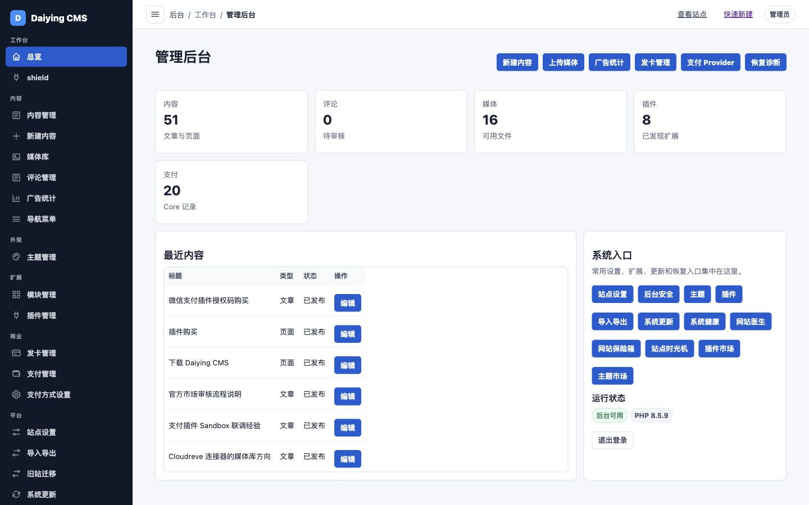
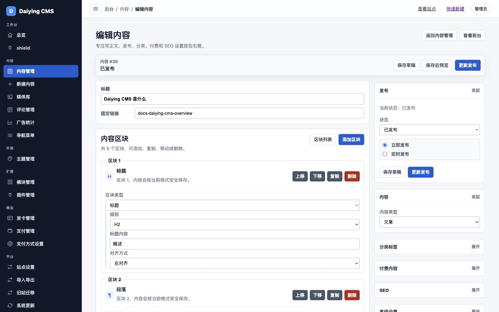
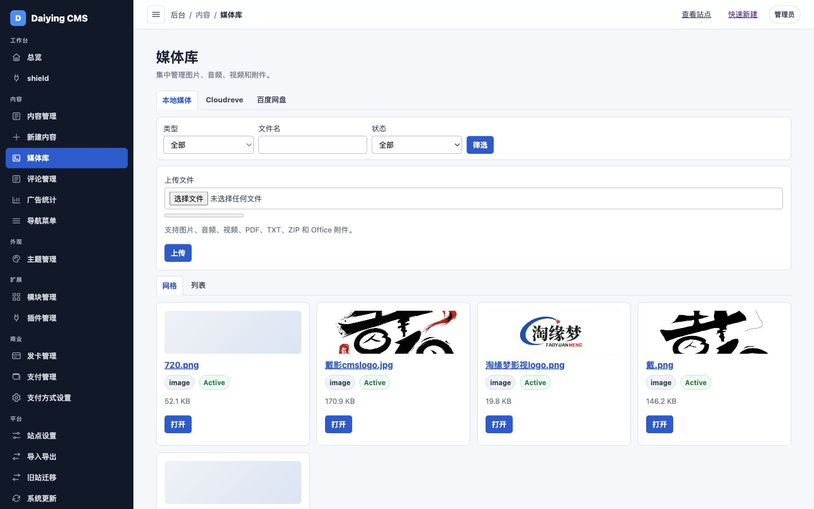
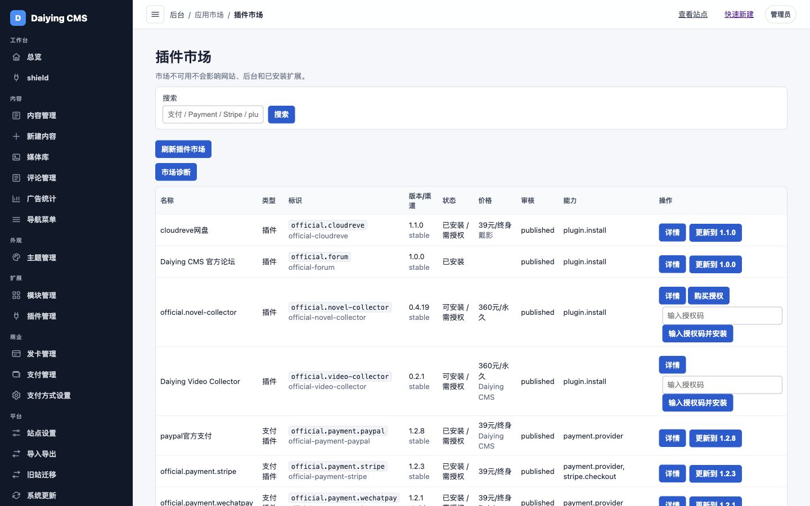
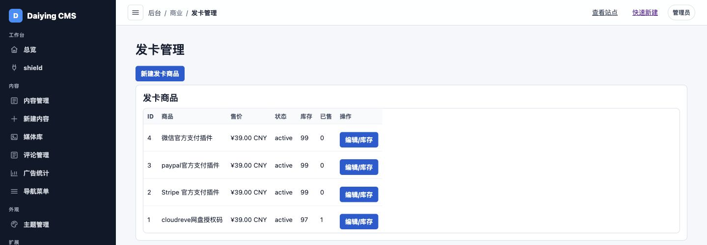
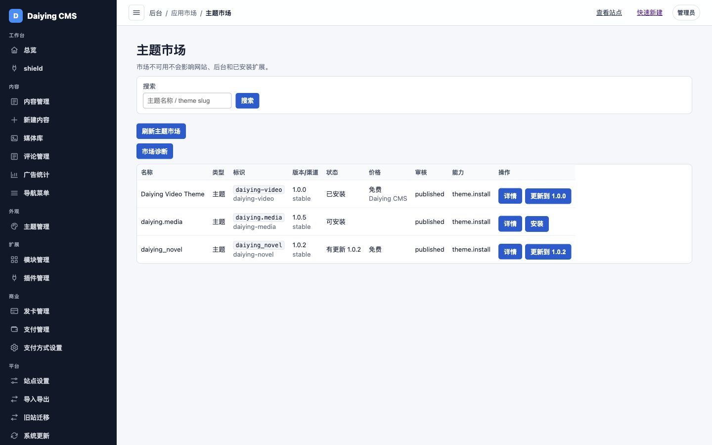
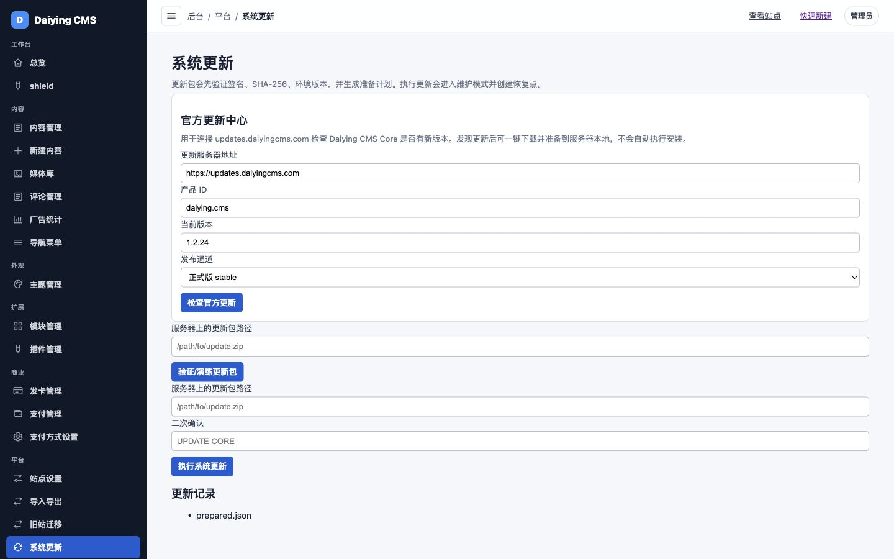

# Daiying CMS

[English](README.md)

Daiying CMS 是一套模块化 PHP CMS，用于构建内容网站、媒体流程、交易基础能力，以及正在开发中的外部渠道分发能力。

当前公开稳定版本：**1.2.44 stable**。



## 项目入口

- 官网：<https://www.daiyingcms.com>
- 文档导航：[docs/README.md](docs/README.md)
- 下载：<https://github.com/daixingwei920/daiying-cms/releases/latest>
- Releases：<https://github.com/daixingwei920/daiying-cms/releases>
- 插件文档：[docs/plugins.md](docs/plugins.md)
- 主题文档：[docs/themes.md](docs/themes.md)
- 全局 AI：[docs/ai.md](docs/ai.md)

## 产品层级

Daiying CMS 不是单一功能脚本，而是按产品层级组织：

1. **Daiying CMS Core**：安装器、后台、路由、内容、媒体、主题、插件生命周期、恢复诊断、签名更新。
2. **Content / Media**：文章、页面、结构化区块、分类、媒体库、上传、外部媒体与存储接入。
3. **Commerce**：商品、价格、订单、支付、付费访问、自动发卡、商业产品和授权存储，以及可选的 AI 商品介绍草稿。
4. **Distribution**：**开发中**。正在开发的外部渠道分发层，用于将 Daiying CMS 的内容数据和 Commerce 数据分发到已支持的外部渠道。
5. **Plugins / Themes**：官方和第三方插件、主题扩展生态。
6. **Update System**：签名 Core 更新、恢复点、完整性检查、健康检查和回滚路径。

## 快速开始

### 1. 环境要求

- PHP 8.3.0 或更高版本。
- PHP 扩展：`pdo`、`json`、`openssl`、`fileinfo`、`zip`。
- SQLite，或 MySQL/MariaDB `utf8mb4`。
- Web 服务器应将站点入口指向 `public/index.php`。
- `storage/` 和 `content/uploads/` 需要 PHP 进程可写。

### 2. 下载

从 [GitHub Releases](https://github.com/daixingwei920/daiying-cms/releases/latest) 下载最新稳定安装包。

当前检查到的发行信息：

- Tag：`v1.2.44`
- 安装包：`daiying-cms-1.2.44-stable.zip`
- SHA-256：见 Release 附带的 `.sha256` 校验文件。

### 3. 安装

1. 上传并解压安装包。
2. 将 Web 服务器站点目录指向 `public`。
3. 确保 `storage/` 和 `content/uploads/` 可写。
4. 打开 `/install`。
5. 选择 SQLite 或 MySQL/MariaDB，并测试数据库连接。
6. 填写站点身份和第一个管理员账号。
7. 通过 `/admin/login` 登录后台。

详细检查项见：[安装文档](docs/installation.md)。

## 重点能力

### Distribution

**状态：开发中**

Distribution 是 Daiying CMS 当前正在建设的差异化方向，但它不是插件商城、商业授权、授权码交付、Core 更新、Capability Pack、Site Vault 或 Shadow Upgrade。

Distribution 的目标是让站长或卖家只在 Daiying CMS 内完成一次内容或商品资料填写，然后由系统根据已接入的外部渠道进行处理、适配和分发。

概念流程：

```text
内容 / 商品资料
-> 图片 / 视频 / 音频等媒体资源
-> Distribution
-> 选择或匹配外部渠道
-> AI 或规则进行渠道适配
-> Provider / Connector
-> 分发
-> 返回成功、失败、渠道异常或 AI 异常状态
```

当前仓库已经在 `content/plugins/official.commerce` 中包含 alpha 阶段的 Commerce Distribution 实现。它仍不是稳定的 Core 模块，最终 Provider / Connector 规范应继续以合并后的真实实现为准。

### Commerce

**状态：基础能力 / Beta**

Core 已包含支付 Provider 设置、支付记录、付费内容/下载授权和自动发卡。当前仓库内置的 Commerce 插件提供商品和订单基础能力，商品编辑页可以通过 Core 站点 AI，根据管理员已填写的商品字段生成商品介绍草稿。第一版不会抓取外部商品链接；商品链接只作为管理员提供的上下文保留给后续流程。

见：[Commerce 文档](docs/commerce.md)。

### 插件生态

插件可通过本地 ZIP 或官方市场安装。生命周期覆盖 manifest 校验、安全解压、静态扫描、依赖检查、原子安装、数据保留策略、迁移、重装恢复和能力边界。

当前仓库可确认的插件包括：

- `official.commerce`
- `official.friend-links`
- `official.novel-collector`
- `official.video-collector`
- `local.storage.baidu`
- `faq_block`

见：[插件文档](docs/plugins.md)。

### 主题生态

主题独立放在 `content/themes`，通过 `theme.json` 声明主题 ID、版本、兼容 Core、支持内容类型、模板、资源和设置项。

当前仓库可确认的主题包括：

- `default`
- `daiying_media`
- `daiying_novel`
- `daiying-video`
- `safe`

见：[主题文档](docs/themes.md)。

### 全局 AI Provider 设置

Core 提供可选的站点级 AI Provider 配置和统一 AI Service API，供 CMS 功能和插件复用。DeepSeek、OpenAI、Grok / xAI、腾讯混元和自定义兼容服务共用 OpenAI-compatible Adapter；Gemini 使用原生 Gemini Adapter。内容编辑器可以使用这个服务进行“AI 帮我写”草稿生成，官方插件也可以默认继承站点 AI 设置，不要求管理员重复填写 API Key。AI 层只负责配置、Provider 调用和安全错误处理；文章摘要、SEO、商品描述、渠道适配等具体用途应由插件或业务模块决定。

### 后台安全

管理员可以保留密码登录，同时为已注册 Passkey 的账号使用无密码后台登录。Passkey 凭据限定在管理员账号和当前站点来源内，登录页继续使用 Core 现有认证与 CSRF 边界。

见：[全局 AI](docs/ai.md)。

## 文档

- [文档导航](docs/README.md)
- [安装部署](docs/installation.md)
- [开发者入口](docs/developers.md)
- [插件](docs/plugins.md)
- [插件 API v1](PLUGIN_API_V1.md)
- [主题](docs/themes.md)
- [主题 API v1](THEME_API_V1.md)
- [Storage Provider API v1](STORAGE_PROVIDER_API_V1.md)
- [REST API v1](REST_API_V1.md)
- [全局 AI](docs/ai.md)
- [Commerce](docs/commerce.md)
- [Distribution](docs/distribution.md)
- [Update System](docs/update-system.md)
- [Foundation Freeze Checklist](CORE_FOUNDATION_FREEZE_CHECKLIST.md)
- [安全策略](SECURITY.md)
- [贡献指南](CONTRIBUTING.md)

## 更新

已安装站点使用的官方更新服务器：

```text
https://updates.daiyingcms.com
```

生产环境上线前建议运行：

```sh
php scripts/validate_production_readiness.php
php scripts/validate_production_readiness.php --json
php scripts/validate_production_readiness.php --strict
```

版本历史见：[CHANGELOG.md](CHANGELOG.md)。

## 截图

以下截图均来自当前真实 Daiying CMS 后台。截图采集时已避开、裁剪或遮罩敏感字段、私人文件列表和订单明细。

| 区域 | 截图 |
| --- | --- |
| 内容编辑器 |  |
| 媒体库 |  |
| 插件市场 |  |
| 发卡商业能力 |  |
| 主题市场 |  |
| 在线更新 |  |

截图采集记录见：[DAIYING_CMS_SCREENSHOT_REPORT.md](DAIYING_CMS_SCREENSHOT_REPORT.md)。

## 授权

当前仓库没有 `LICENSE` 文件。项目所有者明确授权方式前，请不要假设第三方可自由复用、分发或商用。
