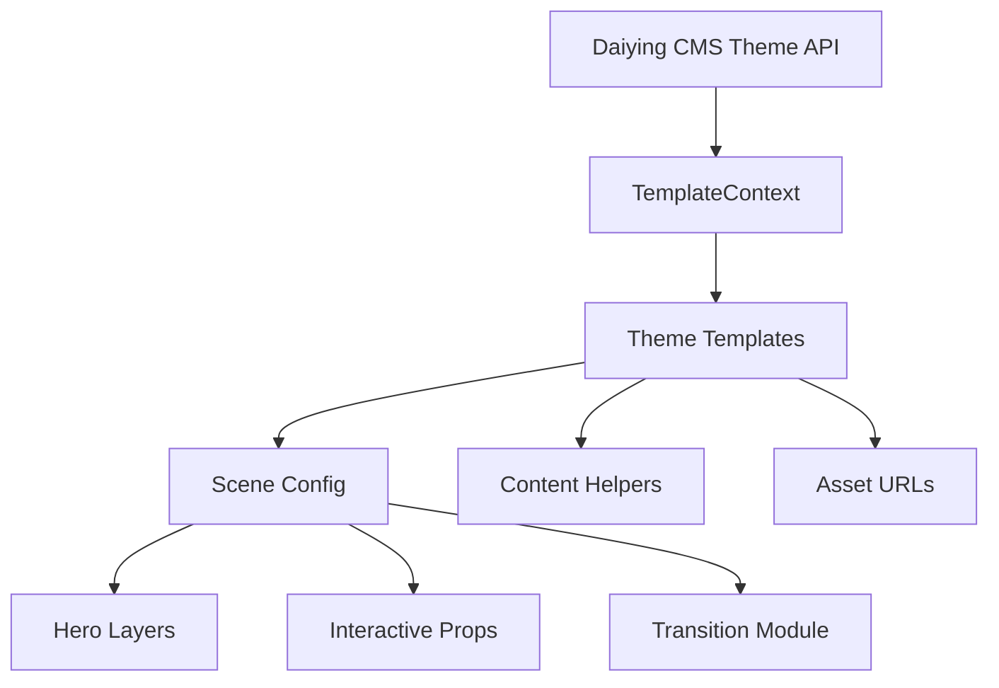

# Framework Architecture

## Layers

The framework separates reusable theme mechanics from theme-specific culture, imagery, and copy.

## Reusable Concepts

- Responsive Hero Stage
- Layer System
- Hero Transition System
- Interactive Prop System
- Main Figure Layer
- Scene Configuration
- Content URL helper
- Logo resolver
- Pagination helper usage

## Theme-Specific Concepts

Keep these outside the reusable framework:

- Culture-specific names
- Culture-specific symbols
- Final artwork
- Final color palette
- Final motion language
- Final copywriting

## Core Boundary

The framework uses existing Daiying CMS Theme API only. If a future theme cannot be built with these APIs, document the missing generic capability before requesting a Core change.
